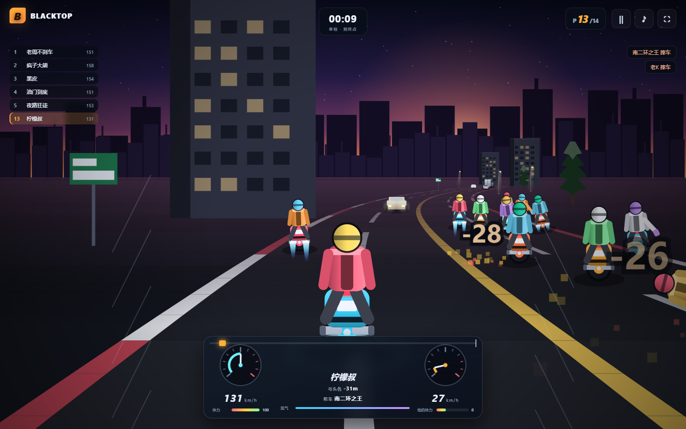

# BLACKTOP

**十五台车挤在同一条路上的在线摩托暴走竞速。** 人机混战、同向车流、迎面大运、
抡起家伙把对手打下车、一脚把大运踢飞。跑在 Cloudflare Workers + Durable Objects 上，
前端是一组静态文件，两端共用同一个确定性内核。

[](docs/shots/)

> 致敬九十年代那批"一边赛车一边打人"的摩托竞速游戏。名字与素材都是自己的，
> 原始游戏的截图只作为本地参考（`refs/`，不入库）。

## 玩法

- **满员十五台车**：一场比赛最多 2 名真人 + 13 个机器人，真人进来就占掉一个机器人名额。
- **八条赛道**：夜色环路、海崖公路、荒野公路、沙漠干道、红杉林道、雪原山口、工业支线、霓虹夜市。
  路面材质、路边风景、车流密度、畜生种类各不一样；跑一条路学到的经验换条路就不作数了。
- **三条命门**：极速、起步、压弯，三台车是取舍不是升级（街霸 400 / 暴走 750 / 铁马 1200）。
- **路上不只是对手**：同向慢车、迎面而来的大运、横穿马路的畜生。撞上就被抬走；
  **十三种社会车辆都能正前方一脚踹飞**（三轮车、轿车一路到公交、油罐车、大运），
  按车重分档给赏金——最重的**大运 1500**。畜生也能踹，牛最值钱。
- **打**：和 1996 那版一样，出拳只有两个方向——`J` 往前打身前的人、`K` 回身打追上来的
  那个人；打到体力见底对手就下车。挥空照样掉体力，氮气冲刺冷却 9 秒，摔车之后要等扶车。
- **家伙**：路面上散着七种家伙（棍棒 / 铁链 / 双节棍 / 撬棍 / 流星锤 / 电棍 / 油瓶），
  压上去就自动进腰。**腰里最多带四件**，`Q` 轮着换；流星锤、电棍、油瓶各有 10 次充能，
  用完就散架。趁对手正在出手的那一瞬间撞上去，还能把他手里那件**抢过来**；
  被撞下车的倒霉蛋会把整串家伙撒回路面，谁快谁捡。
- **房间即社交**：创建房间 → 复制邀请链接发给朋友 → 对方点开就进这一间。
  候场时房主可以放机器人、换赛道、踢掉磨蹭的人；开跑前人人要举手，
  房主可以决定**对局中是否还收人**。

## 键位

方向键与 WASD **同时生效**，不需要切换，也不用松开哪个。开局画面顶上一直挂着这行小字。

| 操作 | 键 | 操作 | 键 |
|---|---|---|---|
| 油门 | `W` / `↑` | 压车 | `A` `D` / `←` `→`（触屏是滑条） |
| 刹车 | `S` / `↓` | 氮气 | `空格`（冷却 9 秒） |
| 前打（打身前） | `J`（`F` 也行） | 回身打（打身后） | `K` |
| 换家伙（腰里轮换） | `Q` | | |
| 暂停 | `Esc` / `P` | | |

攻击在原版里就**只有一种**，空手是拳、捡到家伙是武器，区别是够多远——所以这里也
只有两个方向、没有第二套招式：**身前的人用 `J`，身后贴上来的用 `K`**。迎面来的
大运只踢得飞前打那一下。手里那件家伙是**同一套挥拳轨迹**的延长段，所以"够得着多远"
在画面和判定上是同一个数（`sim/weapons.mjs` 的 `reach` 表）。

## 画面

整套环境是**代码画出来的**，没有一张图片素材：天空与地平线是一张离屏画布，路面是
七十八个梯形从远往近铺，车手是"一台车 + 一个人"两张画片。所有绘制都守
`web/js/art.mjs` 里的三条约定：

1. **光从左上来**。左边亮、右边暗，右下角背光。想画凸起就照这个来。
2. **每一块形状压一圈深色描边**。伪 3D 没有景深模糊，主体只能靠对比度从路面上抠出来。
3. **远处的化进天色**（`haze()`）。没有这一步，两百米外的车和眼前的车一样黑，
   画面就是一张平贴的贴纸。

细节层级由 `detail` 决定（远 / 中 / 近三档）：屏幕上的对手常常只有十几像素高，
那时候头盔、肩膀、车尾三条轮廓线就决定了"这是个人在骑车"还是一坨颜色。

最近一轮修的是**近景里才会露馅的那些笔**，它们的共同点是"半径一大就穿帮"：
光晕（车灯、路灯、探照灯）过去前 45% 的半径是一块平色，远看没事，迎面那台大运
的远光和夜里的灯钱币一放大就是两张白饼；现在是四档衰减，从圆心就开始掉。
烟与火星子也从"圆形渐变 + 彩色圆点"换成了预烘的软边贴图和加色短划——撞车那一下
不再是肥皂泡加彩色纸屑。另外太阳的辉光补到了四档，海边那颗不再是一枚铺开的大圆盘。

地形这一侧修的是一个**坐标系事故**：粒子的 y 是"离地高度"，而投影要的是"世界
高度"，两者在洼地里差一个 `hillAt(z)`。结果是自己后轮扬起的土会飘到天上，
在半空里显成三枚大圆饼。现在 `drawFx` 统一过一层 `worldY(z, y)`。

路上那些畜生（牛、羊、鹿、野猪、狗、鹅）也按骨架重画了一遍：腿是两段带蹄的、
躯干是贝塞尔轮廓、脖子从躯干里长出来，五官各归各。上一版它们共用一套方块零件，
在 90 像素/米下勉强能认，摆到路中间就是一头"盖着黑补丁的白桌子"。

## 它跑在哪

**直接打开 <https://blacktop-api.lemonhall.me> 就能玩**——Worker 一边提供 `/v1/*`
接口，一边把 `web/` 当静态资源发出去，所以前后端同源、不跨域、一次部署。

| | 地址 | 说明 |
|---|---|---|
| 仓库 | `https://github.com/lemonhall/blacktop` | 代码、文档、出图脚本都在这 |
| 线上（可玩） | `https://blacktop-api.lemonhall.me` | Cloudflare Workers + Durable Objects + D1 |
| 前端（可选） | Vercel（`npx vercel --prod`） | 同一份 `web/`，`BLACKTOP_API` 指向后端即可 |

线上自检（不用开浏览器，30 秒）：

```powershell
$env:SMOKE_BASE='https://blacktop-api.lemonhall.me'; npm run smoke
```

部署之后的自检记录（2026-09-30）：冒烟 **40 / 40**、联调 **23 / 23** 通过，
都是在线上域上跑的真链路（含线上多租户隔离、两个真人、中途补位、跑完结算）。

后端用自定义域而不是 `*.workers.dev`：后者在国内是**解析层就被污染**的，
域名能查出来却连不上。`wrangler.jsonc` 里 `custom_domain: true` 表示 DNS 记录与
证书都由 wrangler 建，不用手工去面板加。

## 本地跑起来

```powershell
npm i
Copy-Item .dev.vars.example .dev.vars   # 里面有 SESSION_SECRET 与 ADMIN_KEY（自己改）
npx wrangler dev                        # 起在 http://127.0.0.1:8790
```

全新克隆的本地 D1 是空的，**先注册一个租户**（租户就是"一个游戏"的名字空间）：

```powershell
$admin = (Get-Content .dev.vars | Where-Object { $_ -match '^ADMIN_KEY=' }).Split('=',2)[1]
curl.exe -X POST http://127.0.0.1:8790/v1/tenants -H "Authorization: Bearer $admin" `
  -H "content-type: application/json" -d '{\"id\":\"neon\",\"displayName\":\"夜色摩托\"}'
```

然后打开 `http://127.0.0.1:8790` —— 建房、放机器人、点出发。
换个租户就加参数：`http://127.0.0.1:8790/?tenant=neon`；
前端连别的后端就加 `?api=https://…`（会被记进 localStorage）。

## 测试

三条命令，各验一层，**都不碰线上账号、不花一分钱**：

```powershell
npm test        # 254 项单元测试：共享内核、名册状态机、时间算术、线协议、家伙、画法契约
npm run smoke   # 40 项冒烟：只用 HTTP + WebSocket 打一遍服务端契约（跑在已启动的 dev 上）
npm run e2e     # 23 项联调：真 Chrome、两个客户端、从建房跑到结算
npm run shots   # 顺手出图到 docs/shots/
```

| 命令 | 它回答的问题 | 需要什么 |
|---|---|---|
| `npm test` | "内核算得对吗"——赛道、物理、AI、命令队列、房间时钟、线协议、家伙系统、**画法契约** | 只要 Node 20+ |
| `npm run smoke` | "这次部署还能玩吗"——路由、令牌、房间闸门、多租户隔离 | 已启动的 `wrangler dev`（或线上后端） |
| `npm run e2e` | "界面与渲染这条线通吗"——两个真人、补位、播报、跑完全程结算 | 本机 Chrome（用 `channel:"chrome"`，**不下载** Playwright 自带浏览器） |

"画法契约"指的是那批**给美术写的单元测试**（`tests/web-*-art.test.mjs`）：美术好不好看
没法自动断言，但它的几条硬规矩可以，而这些规矩恰好是画崩的主要原因——
`save/restore` 必须配平（差一次，这一帧之后所有东西都歪）、`fillStyle` 不能是
`undefined`（浏览器会默默忽略）、坐标里不能有 NaN（不报错，那一笔凭空消失）、
远景必须比近景省笔数、迎面来的车必须点着大灯。跑法就是 `npm test`，不需要浏览器。

冒烟与联调都可以打线上：

```powershell
$env:SMOKE_BASE='https://blacktop-api.lemonhall.me'; npm run smoke
$env:E2E_BASE='https://blacktop-api.lemonhall.me'; npm run e2e    # 只读，不改线上数据以外的任何东西
```

## 多租户：一个账号跑好几款游戏

租户是真正的隔离边界，不是装饰字段：

| 层 | 机制 |
|---|---|
| 房间宇宙 | Durable Object 名 = `${tenant}:${roomId}`，两家的房间是两个不同的对象 |
| 令牌 | 载荷里签着租户，**令牌的租户必须等于房间的租户**，否则 401 |
| 配额 | D1 `tenants.rules`：每租户的房间数、真人上限、机器人上限、是否允许游客 |
| 前端 | `?tenant=` / `?api=` 切换，同一个静态包能连不同租户 |

冒烟里的"多租户"那几条就是钉这个的：A 租户的房间目录里看不见 B 租户的房间，
A 的令牌闯 B 的房间被拒。

## 部署

```powershell
npx wrangler d1 create blacktop            # 把返回的 database_id 填进 wrangler.jsonc
npx wrangler secret put SESSION_SECRET     # 令牌签名密钥
npx wrangler secret put ADMIN_KEY          # 注册租户用的管理员密钥
npx wrangler deploy                        # 自定义域 blacktop-api.lemonhall.me 由 wrangler 建

# 注册第一个租户
curl.exe -X POST https://blacktop-api.lemonhall.me/v1/tenants `
  -H "Authorization: Bearer $env:ADMIN_KEY" -H "content-type: application/json" `
  -d '{\"id\":\"neon\",\"displayName\":\"夜色摩托\"}'

$env:SMOKE_BASE='https://blacktop-api.lemonhall.me'; npm run smoke   # 部署完立刻自检
```

前端想单独放 Vercel：`npx vercel --prod`，`vercel.json` 已经把
`BLACKTOP_API` 指到后端、`outputDirectory` 指到 `web/`（`.vercelignore` 里
挡掉了 `.wrangler/` 与 `.dev.vars`——前者在 `wrangler dev` 跑着时是独占锁，
上传会以 `EBUSY` 失败且不告诉你为什么）。

## 文档

| 文件 | 写给谁 | 内容 |
|---|---|---|
| [docs/architecture.md](docs/architecture.md) | 架构师 | 前端做什么、后端做什么、边界为什么划在那里、多租户与时间模型 |
| [docs/flow.md](docs/flow.md) | 架构师 / 集成方 | **一局比赛打了哪些请求**，每条请求长什么样、解决什么问题 |
| [docs/protocol.md](docs/protocol.md) | 实现者 | 线协议字段表、三条不变式、改协议的三条规矩 |
| [docs/feel.md](docs/feel.md) | 改手感的人 | **为什么拳头打得上**：时间账、判定窗、冷却缓冲、机器人追赶、怎么复测 |
| [docs/shots/](docs/shots/) | 所有人 | 界面截图与"怎么重新出这批图" |

## 代码结构

```
sim/    共享内核：服务端与浏览器逐字相同（赛道 / 物理 / 车流 / AI / 线协议）
src/    后端：Worker 入口 + Room DO + Lobby DO + D1 战绩
web/    前端：静态站点，没有打包器，直接 import 共享内核（../sim/*.mjs）
tests/  单元测试        tools/  构建、冒烟、联调、出图、探针
```

前端引用共享内核写的是**相对路径**（`web/js/road.mjs` 里的 `../../sim/constants.mjs`）：
浏览器从 `/js/road.mjs` 出发解析出来仍然是 `/sim/constants.mjs`（URL 解析过不了站点根，
写几层 `..` 都一样），和写死绝对路径完全等价；而 `node --test` 会顺着它找到**源码
目录**，渲染层因此第一次可测——它过去是测试盲区，就因为在源码里写死了一个只有浏览器
才认识的绝对路径。

三条工程约定，写在这里是因为它们经常被违反：

1. **只有一份真相**。赛道数据、物理、线协议都在 `sim/`；前端的选项列表直接从
   它渲染，后端的 `/v1/meta` 也从它生成。复制一份常量是这类项目最常见的腐烂。
2. **单个文件尽量不超过 300 行**。超了就按职责拆成兄弟文件，不是塞进一个更大的
   "总文件"。
3. **界面跟着服务端走**。大厅、候场、赛道、结算四屏的状态都由服务端消息驱动，
   客户端的本地预测只负责"我自己这台车看起来顺不顺"。

## 许可

MIT
