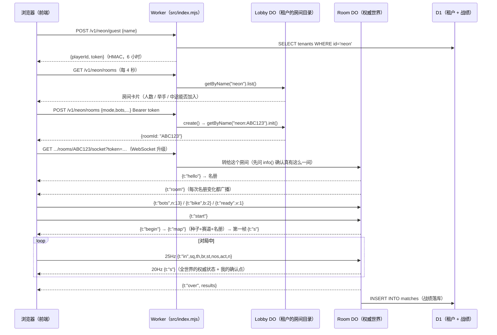

# 一局比赛打了哪些请求

这份文档回答一个问题：**从打开 URL 到看到结算，前端和后端之间到底发生了什么。**

每条请求都写了四件事：谁发的、什么时候发、报文长什么样、它解决什么问题。
字段的完整含义在 [protocol.md](./protocol.md)，模块分工在 [architecture.md](./architecture.md)。

下面用一间房、两个人、十三个机器人的一场比赛做例子。

## 全景



---

## 0. 打开页面：先拿到规则，再谈连谁

| 请求 | 去哪儿 | 干什么 |
|---|---|---|
| `GET /` `GET /js/*.mjs` `GET /sim/*.mjs` | 静态资源 | 前端与**共享内核**（`sim/` 被打包进 `web/sim/`） |

后端地址与租户在 `web/js/config.mjs` 里定，优先级是
`?api=` > localStorage > 构建期注入 > 同源。所以"同一个静态包连哪个后端"是
运行期的事，不用重新构建。

## 1. 进站：拿一张令牌

```
POST /v1/neon/guest
{ "name": "柠檬叔" }
→ 200 { "playerId": "g_Fhog…", "name": "柠檬叔", "tenant": "neon", "token": "…" }
```

- 令牌是**无状态**的：载荷 `tenant|playerId|name|exp` 加 HMAC(`SESSION_SECRET`)，
  带 6 小时有效期。它不是 JWT——没必要为了三个字段引入一个库。
- 令牌里带着玩家 id，所以**改名字必须重新签一张**。这件事交给
  `web/js/identity.mjs` 的闸门：同一时刻只认最新那次签发结果，
  否则"用旧令牌建房、用新令牌连 socket"会让房主忽然没有房主权限。
- 名字在进房前问一次（`web/js/namegate.mjs`），落在 localStorage（`blacktop.name`）。
  空名字不放进房间：一屋子人都叫"车手"，房主连踢人都说不清。

## 2. 大厅：三个只读请求，4 秒一轮

| 请求 | 用途 | 失败怎么办 |
|---|---|---|
| `GET /v1/neon/rooms` | 房间卡片：赛道、真人 n/上限、机器人、举手数、中途能否加入 | 这是**必须成功**的那一条，失败就提示连不上后端 |
| `GET /v1/neon/leaderboard?limit=8` | 排行榜（胜场 / 撂倒 / 赏金） | 锦上添花，挂了就当空榜 |
| `GET /v1/neon/matches?limit=8` | 最近战绩 | 同上 |

房间列表走 4 秒轮询而不是长连接：列表慢一点没人受伤，为它多维持一条常驻连接
会把复杂度拉回十年前。

`GET /v1/meta` 也在，但它不是给这个前端用的——前端直接 import `sim/data.mjs`，
**只有一份真相**。这个接口是留给外部集成的。

## 3. 建房 / 匹配 / 进房

```
POST /v1/neon/rooms                Authorization: Bearer <token>
{ "name":"夜色环路 · 八号车库", "mode":"city", "difficulty":1,
  "bots":13, "joinLive":true }
→ 201 { "ok":true, "roomId":"ABC123", "room":{ …公开视图… } }

POST /v1/neon/quickmatch          # 挑一间还在候场、没满、赛道相同的；没有就新建
→ 200 { "ok":true, "roomId":"ABC123", "reused":true }
```

- `mode` / `difficulty` / `bots` 全部**在服务端校验**：乱填的赛道回落到默认赛道
  （猜一条不存在的赛道比拒绝更糟），机器人数夹在租户规则与模式上限之间。
- 真人上限取"**租户规则 ∩ 模式上限**"的较小值。报模式上限的后果是：一个只允许
  1 个真人的租户会显示 1/2，快速匹配还会照 2 去挑房间。

## 4. 进房：WebSocket 握手

```
GET /v1/neon/rooms/ABC123/socket?token=<token>      Upgrade: websocket
```

- Worker 先 `info()` 确认"真有这一间"，没有就干脆地回 `404 unknown_room`——
  邀请链接会被人传来传去，散掉的房间必须得到一个明确的答复。
- 真正的令牌校验在 **Room DO 里**：DO 的名字里已经带了租户，它自己就能比对
  `session.tenantId === state.tenant`，不匹配回 401。跨租户闯房间就挡在这里。
- 连上立刻回：

```
{ "t":"hello", "you":{ "id":"g_Fhog…", "name":"柠檬叔" },
  "room":{ "id":"ABC123", "ph":"staging", "members":[…], "you":{ "host":true } } }
```

## 5. 候场：一间房就是一个名册

上行（都是"改一下房间"的意思，服务端说了算）：

| 上行 | 谁可以发 | 作用 |
|---|---|---|
| `{t:"bike", b:2}` | 任何人 | 选车。连上时客户端会自动报一次本机选的那台 |
| `{t:"ready", v:1}` | 非房主 | 举手 / 放下手。房主的"出发"按钮就是他的表态，服务端的 `ready` 会被拒 |
| `{t:"bots", n:13}` | 房主 | 机器人个数（真人进来就占掉一个机器人名额） |
| `{t:"config", mode, joinLive}` | 房主 | 换赛道、开关"允许中途加入" |
| `{t:"kick", id}` | 房主 | 踢人。被踢的人收到 `kicked`，十分钟内进不来 |
| `{t:"start"}` | 房主 | 开局。有人没举手就回 `error: not_ready` + 还没举手的人名 |
| `{t:"ping"}` | 任何人 | 心跳，2 秒一次；顺便量 RTT，也顺便推世界一格 |

下行：`{t:"room"}`（**名册每次变化都广播给所有人**，客户端整个候场页就是它的投影）、
`{t:"error"}`、`{t:"kicked"}`。

## 6. 发车：三条消息定下一局

房主点"出发"之后，Room 依次广播：

```
{ "t":"begin", "room":{ "ph":"live", … } }        # 换屏，清掉上一局的残留状态
{ "t":"map",   "mode":"city","seed":113448647,    # 规则，不是结果
  "lanes":4,"length":3600,"countdown":3.2,
  "roster":[[7,"g_…","human","柠檬叔",2,3,1], …] }
{ "t":"s", … }                                    # 开局第一帧快照
```

- **地图发的是种子**：客户端拿同一颗种子跑同一个 `createTrack()`，算出逐位一致的
  曲率与坡度。几百字节 vs 几兆的"网格文件"，而且永远不会和服务器不同步。
- 地图**必须排在快照前面**：客户端要靠名册才知道"快照里哪条记录是我"。
- 第一帧快照不能省：客户端要先在自己的快照里找到"我"才会开始上行输入，而服务端
  的推进是输入驱动的——少了这一帧，两边会互相等，直到 5 秒后的 alarm 兜底。
- 名册 `roster` 里每行是 `[车号, ownerId, 人/机器人, 名字, 车型, 配色, 技能]`。

## 7. 对局中：25Hz 上行，20Hz 下行

上行（每 40ms 一条，这就是"输入时间线"）：

```
{ "t":"in", "sq":128, "th":1, "br":0, "st":-0.5, "nos":0, "act":0, "n":3 }
```

| 字段 | 含义 |
|---|---|
| `sq` | 命令序号（单调递增，用来对账） |
| `th` `br` `st` | 油门 / 刹车 / 压车（-1 左 … +1 右） |
| `nos` | 氮气 |
| `act` | 出拳（只在命令的第一格生效，按位：1 前打 2 回身打；同时按下时向前优先） |
| `n` | **这条命令代表几格**（1 格 = 1/60 秒）。25Hz 上行时通常是 2~3；倒数里是 0 |

下行（每 50ms 一帧快照）：

```
{ "t":"s", "tk":1523, "ph":"live", "tm":25.383, "cd":0,
  "r":[ { "i":7,"x":-3.2,"z":1284.5,"v":183.4,"rk":3,"d":2,"dy":0,…,
          "ak":128,"ax":-3.2,"az":1284.5,"av":50.9,"alt":-0.4,"q":2 }, … ],
  "tr":[ [31,"van",-6.1,1310.2,1,1,0,0,72], … ],
  "ev":[ {"k":"wreck","i":4,…} ] }
```

`ak/ax/az/av/alt` **只发给我自己**：那是我这条输入时间线的权威确认点。
我拿到它之后，把还没被确认的命令重放一遍（`web/js/predict.mjs`），
就得到"我此刻应该在哪"。正常情况下这次重算出来的位置和我本地预测的是同一个——
画面上什么都不会发生，不会再出现"往前走了一段又跳回一小段"。

## 8. 中途加入：同一颗种子，只换名册

对局进行中有人拿着邀请链接进来时：

1. 新人照常握手 → 服务端把他加进名册，并在场上给他一台车
   （落在领跑者身后 45 米、速度取全场平均：看得见尾灯、追得上、不占便宜）；
2. 场上满 15 台就先挪走一个**落后最多**的机器人——真人占的是机器人的名额；
3. 服务端**重新广播一次 `map` 给所有人**——种子和赛道一模一样，变的只有名册。

第 3 条是这条链路上最容易漏的一步：身份住在名册里，新人如果拿的还是开局那份，
他在自己屏幕上是块石头（本地预测找不到"我"，油门毫无反应），
在别人屏幕上是一台没名字的灰车。

客户端对这次重发有专门的判断（`session.mjs#applyMap`）：**同一颗种子的重发只换
名册**，不重建赛道——重建会把 `S.track` 换成新对象，而本地预测的迷你世界还指着
旧的那一个，画面上就是"车沿着一条看不见的线骑"。

## 9. 结算

第一名冲线之后，世界调用 `settle()`：按冲线时刻排、没冲线的按已跑距离排、
发赏金（名次底薪 + 撂倒 ×250 + 踹飞车/畜生 ×1000）、**并且把世界相位改成 `over`**。
然后：

```
{ "t":"over", "results":{ "reason":"finish","track":"city","seed":…,
  "players":[ { "rank":1,"name":"疤脸","time":76.15,"downs":3,"kills":0,"cash":2750,"dnf":0 }, … ],
  "payout":{ "g_…":2750, "bot:3":1200 } } }
```

房间同时把这一局写进 D1（`INSERT OR REPLACE INTO matches`）。排行榜就是在这份
JSON 明细上用 `json_each` 聚合出来的，**只统计人类**——机器人上榜会把榜单一夜
之间刷成机器人名字，那这榜单就没意义了。

结算之后房主可以 `{t:"reset"}` 回到候场；**全体举手状态会被清空**，
上一局的 ready 不能顺延到下一局。

## 10. 退房与回收

- 客户端关掉 socket，或按 `Esc`/`P` 之后点"离开这间房"。
- **掉线不等于退房**：名册里删掉，但场上那台车留着（重连进来接着骑同一台），
  输入队列清空——那是"我接下来还要往哪走"的债，人不在了就不该继续兑现。
- 房间的回收判据只有两条：连接全断，或者连着却 30 分钟一条消息都没来。
  回收时把房间从目录里摘掉，名册清空。

## 附：全部端点一览

| 方法 | 路径 | 鉴权 | 作用 |
|---|---|---|---|
| GET | `/v1/health` | — | 存活探测（冒烟脚本第一条就打它） |
| GET | `/v1/meta` | — | 赛道 / 车型 / 难度表（给外部集成） |
| GET | `/v1/tenants` | — | 租户列表 |
| POST | `/v1/tenants` | `ADMIN_KEY` | 注册租户 |
| POST | `/v1/:tenant/guest` | — | 游客令牌 |
| POST | `/v1/:tenant/sessions` | 租户 server key | 服务端签发指定玩家的令牌（对接自家账号系统） |
| GET | `/v1/:tenant/rooms` | — | 房间目录 |
| POST | `/v1/:tenant/rooms` | 玩家令牌 | 建房 |
| POST | `/v1/:tenant/quickmatch` | 玩家令牌 | 快速匹配 |
| GET | `/v1/:tenant/rooms/:roomId/socket` | 玩家令牌 | 对局通道（WebSocket） |
| GET | `/v1/:tenant/leaderboard` | — | 排行榜 |
| GET | `/v1/:tenant/matches` | — | 最近战绩 |
